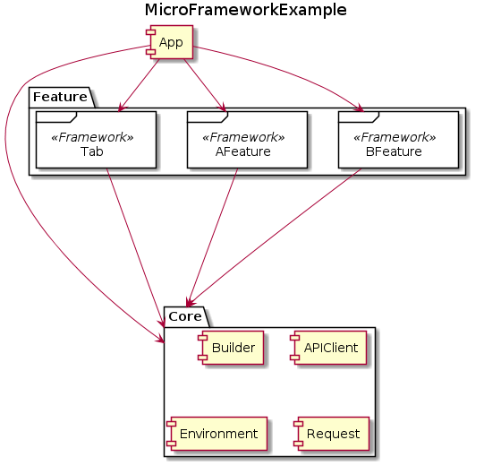

# MicroFrameworkExample
## Overview
- MicroFramework example project
- SeeAlso: https://speakerdeck.com/mercari/mtc2018-implementing-typeerasure-in-viewcontroller

## Environment
- Xcode12.1
- Swift5.3

## Getting Started
1. open `MicroFrameworkExample.xcodeproj`

## Architecture

